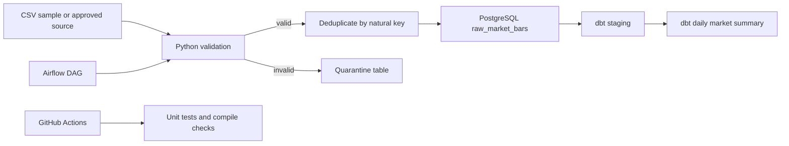

# Dhan Data Lake v2

A portfolio-grade market-data ingestion platform that demonstrates reliable batch loading, idempotent PostgreSQL upserts, quarantine handling, dbt transformations, orchestration, automated tests, and containerized local execution.

The repository contains two layers:

- `src/dhan_data_lake/`: the credential-free production-data-platform increment.
- The original MongoDB/DhanHQ modules: preserved as legacy integration work and not described as production-ready until their empty modules and live-API tests are completed.

## What is implemented

- Typed OHLCV validation with timezone-aware timestamps.
- Deterministic natural keys: `(security_id, interval, event_time)`.
- Idempotent PostgreSQL `INSERT ... ON CONFLICT` ingestion.
- Failed-record quarantine with the original payload and reason.
- Credential-free sample dataset for repeatable demonstrations.
- dbt staging and daily market-summary models with quality tests.
- An Airflow DAG that invokes the same tested CLI entrypoint.
- Docker and Docker Compose configuration.
- Standard-library unit tests and GitHub Actions CI.
- Architecture, deployment, lineage, and operational documentation.

## Architecture



## Quick start without credentials

Python 3.11+ is required.

```bash
python -m venv .venv
source .venv/bin/activate
python -m pip install -e '.[dev]'
python -m dhan_data_lake.cli --input data/sample/market_bars.csv --dry-run
python -m pytest -q
```

The dry run validates, deduplicates, and reports the sample data without requiring PostgreSQL or DhanHQ credentials.

## PostgreSQL demonstration

```bash
cp .env.example .env
docker compose up --build --abort-on-container-exit
```

The loader waits for PostgreSQL, applies `sql/001_init.sql`, ingests the sample data, and exits. Rerun the loader to demonstrate that the natural key prevents duplicate rows:

```bash
docker compose run --rm loader
```

## dbt

Install the optional analytics dependencies and copy the example profile:

```bash
python -m pip install -r requirements-analytics.txt
mkdir -p ~/.dbt
cp analytics/profiles.yml.example ~/.dbt/profiles.yml
cd analytics
dbt build
```

## Airflow

`orchestration/dags/market_data_pipeline.py` is intentionally thin. It calls the tested CLI rather than duplicating ingestion logic. Mount the repository into an Airflow environment and set `DATA_INPUT_PATH` and `DATABASE_URL`.

## Quality gates

The project is ready to describe as completed only when all of the following pass:

```bash
python -m compileall -q src tests
python -m pytest -q
docker compose config
```

Live DhanHQ ingestion remains a separate acceptance gate because it requires user-owned credentials and market-hours validation.

## Documentation

- [Architecture and lineage](docs/architecture.md)
- [Deployment](docs/deployment.md)
- [Operational runbook](docs/runbook.md)
- [API and CLI reference](docs/api_reference.md)

## Security

- Never commit `.env`, access tokens, database passwords, or exported account data.
- Use read-only DhanHQ credentials for ingestion where the API permits.
- The sample dataset is synthetic and contains no account or customer information.

## Honest resume wording

> Built a credential-free market-data ingestion pipeline with Python, PostgreSQL, idempotent upserts, quarantine handling, dbt quality tests, Docker, and CI; documented lineage and operational recovery procedures.

Do not claim live production scale, real-time WebSocket coverage, or uptime metrics until those acceptance tests have been run and documented.
